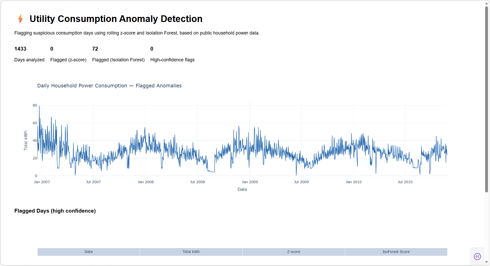

# ⚡ Utility Consumption Anomaly Detection

Detecting suspicious or abnormal electricity consumption patterns using public household power-usage data — a public-data mirror of real-world utility fraud/anomaly detection workflows.

## Problem
Utility companies lose significant revenue to non-technical losses: meter tampering, unauthorized connections, and billing irregularities. Manually reviewing every account for suspicious patterns doesn't scale. This project builds a pipeline that flags accounts worth a closer look, based on consumption behavior alone.

## Approach
1. **Data**: [UCI Individual Household Electric Power Consumption dataset](https://archive.ics.uci.edu/dataset/235/individual+household+electric+power+consumption) — minute-level power readings from a single household over ~4 years.
2. **Feature engineering**: Roll up to daily/weekly consumption, derive features like rolling averages, sudden drops/spikes, load factor, and time-of-day usage shape.
3. **Anomaly detection**: Compare statistical methods (rolling z-score, IQR) against an unsupervised ML model (Isolation Forest) to flag outlier periods.
4. **Visualization**: Interactive Dash dashboard showing consumption trends with flagged anomalies highlighted, so a reviewer can see *why* a period was flagged.

## Result
Analyzed 1,433 days of household electricity consumption. The rolling z-score method (threshold 2.5σ) flagged **0 days** as anomalous, while Isolation Forest flagged **72 days (~5%)** — consistent with its configured contamination rate. The two methods didn't agree on any single day, revealing a key limitation: z-score thresholds only catch large deviations from a *recent* rolling average, so they miss gradual seasonal shifts and multi-day drift patterns. Isolation Forest instead looks across all engineered features simultaneously (day-over-day change, load factor, weekend behavior), catching subtler multivariate anomalies a single-variable threshold overlooks entirely. This mirrors a real tradeoff in fraud/anomaly detection systems: simple rule-based flags are transparent and fast, but under-flag; ML models catch more but need review by an analyst before acting on the score alone.



## Stack
Python · pandas · scikit-learn · Dash · Plotly

## Project Structure
```
utility-anomaly-detection/
├── data/               # raw and processed data (not committed if large)
├── src/
│   ├── data_loader.py      # download & clean the dataset
│   ├── features.py         # feature engineering
│   ├── anomaly_detection.py # detection models
│   └── dashboard.py        # Dash app
├── notebooks/          # exploratory analysis
├── assets/             # dashboard screenshots for README
└── requirements.txt
```

## Setup
```bash
git clone https://github.com/<your-username>/utility-anomaly-detection.git
cd utility-anomaly-detection
pip install -r requirements.txt
python src/data_loader.py       # downloads & prepares data
python src/anomaly_detection.py # runs detection, saves flagged results
python src/dashboard.py         # launches Dash app at localhost:8050
```

## Next Steps
- [x] Add screenshot of dashboard here
- [ ] Investigate why z-score and Isolation Forest disagree — tune z-score threshold and inspect a sample of the 72 flagged days
- [ ] Compare model performance against a labeled anomaly set (if available)
- [ ] Extend to multiple households / accounts for a portfolio-level view
